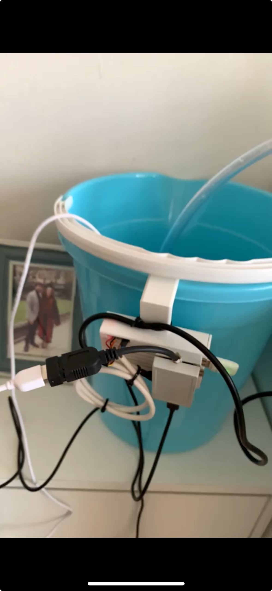
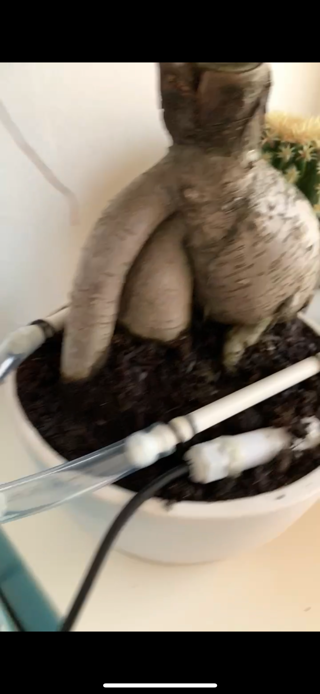

# Inaffio 🌱

**Remote plant watering & monitoring system with Telegram control and user management**

---

## 🔍 Overview

Inaffio is a Python-based system designed to monitor plant conditions (soil moisture, temperature, etc.) and control irrigation remotely.  
The system includes **scheduled tasks**, a **Telegram bot for remote commands**, and a simple **user management layer** to restrict access.  

The images below show the complete **Inaffio hardware setup**:

- A **Raspberry Pi** runs the software, using GPIO pins and a small **microcontroller** to control the pump and collect data from the soil sensor.  
- The **pump** is placed inside a water bucket and connected to the irrigation tubing.  
- The **case**, the tube splitter, and the water **sprinkler diffusers** were all **3D-printed**.  
- The **soil moisture sensor** is inserted **obliquely into the soil**: this placement provides an average reading across different depths, ensuring that the measured humidity better reflects the real conditions of the soil (not just the surface).  


<p align="center">
  
  
  
</p>

---

## ✨ Features
- 🌡️ Read & persist telemetry (TinyDB file `telemetry.json`)
- 🤖 **Telegram bot** control (pyTelegramBotAPI)
- 👤 **User management**: allow-list of Telegram usernames
- 💧 **Watering** flow with inline confirmation (Yes/No)
- 🚨 **Alarms** queue with periodic notifications
- 📊 **/stats**: plots last 24h temperature/humidity (Matplotlib, headless)
- ⚙️ Configurable via JSON (`configs.json`) and `.env` token
- 🧵 Background **scheduler** (periodic alarm pushes)

---

## 🧰 Tech Stack
- Python, [pyTelegramBotAPI](https://github.com/eternnoir/pyTelegramBotAPI), TinyDB, Matplotlib
- dotenv for secrets, headless plotting via `matplotlib.pyplot.switch_backend("Agg")`
- Simple queues for **alarms** and **pump** control injected into `BotTask`

---

## 🚀 Getting Started

1. Clone the repository  
   ```bash
   git clone https://github.com/peppetort/inaffio.git
   cd inaffio
```

2. Install dependencies

   ```bash
   pip install -r requirements.txt
   ```

3. Configure the system

   * Edit `configs.json` → thresholds, watering intervals, durations
   * Edit `users.json` → add authorized Telegram user IDs
   * Set your **Telegram bot token** as environment variable:

     ```bash
     export TELEGRAM_TOKEN=your_token_here
     ```

4. Run the system

   ```bash
   python inaffio.py
   ```

5. Optional: start scheduled tasks in background

   ```bash
   python tasks/scheduler.py
   ```
---

## 🤖 Telegram Commands

- `/start`  
  Welcomes the user and confirms monitoring is active (for authorized users).

- `/telemetry`  
  Sends the **latest** telemetry sample (temperature & humidity) from TinyDB (`telemetry.json`).

- `/water`  
  Asks for **inline confirmation** (Yes/No).  
  - **Yes** → if `pump_queue` is empty, enqueue a watering request and ack; otherwise report it’s already watering.  
  - **No** → cancel.

- `/alarms`  
  Lists **current alarms** present in `alarm_queue` (time, temperature, humidity) in human-readable format.

- `/alarms_off`  
  Inline confirmation; on **Yes** clears the entire `alarm_queue`.

- `/stats`  
  Plots **last 24 hours** telemetry (two subplots: temperature °C, humidity %) and sends the PNG back to the chat.

---

## 🧪 Scheduler & Alarms
A background `sched.scheduler` thread periodically (default every **10 minutes**) checks `alarm_queue` and pushes the **first** alarm to all known `chat_id`s of allowed users.

- Period is configurable via `configs.json` (`alarm_notification_period`, seconds).
- The scheduler re-queues itself to run again.

---

## ⚙️ Configuration

### `.env`
TOKEN=your_telegram_bot_token_here

pgsql
Copia codice

### `configs.json` (example)
```json
{
  "bot_task": {
    "alarm_notification_period": 600,
    "allowed_users": [
      "your_telegram_username",
      "teammate_username"
    ]
  }
}
```

